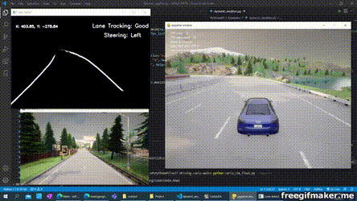
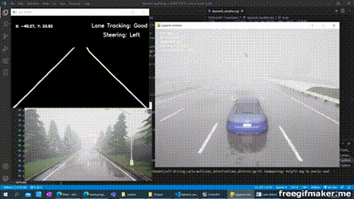
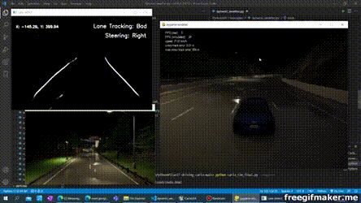
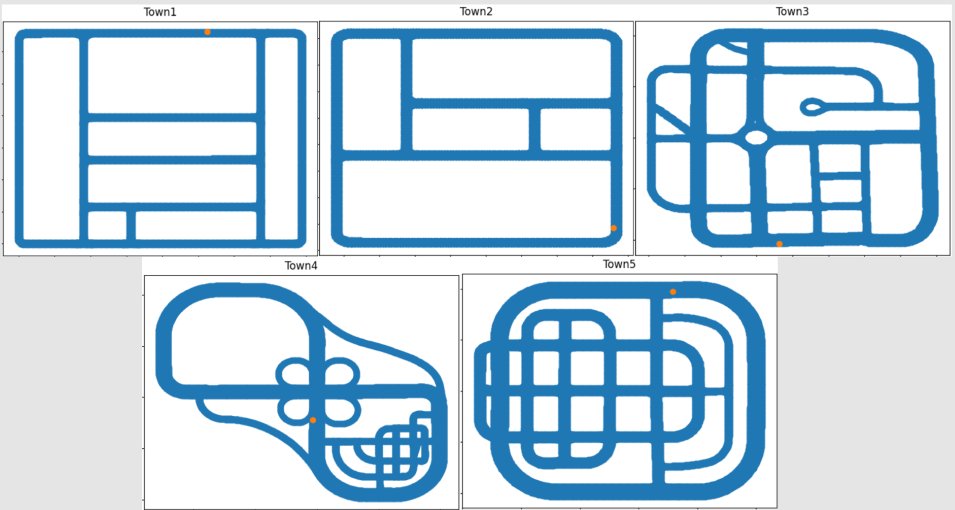

# Self-driving Carla


 🤖 CS106.L22.KHCL - Trí tuệ nhân tạo 🤖

[Trần Minh Tiến](<https://github.com/fantashi099>) - 18521492

[Nguyễn Hữu Doanh](<https://github.com/huudoanh123qn>) - 18520606

[Nguyễn Xuân Đỉnh](<https://github.com/zoxuandinhzo>) - 18520603

---


### Introduction:

Carla self-driving based on lane detection. 

*This code is only test on Window10, with 4GB GPU Nvidia GTX-1050!!!

### System requirements:

- x64 system
- 165 GB disk space
- at least 6 GB GPU (8 GB is recommended)
- Two TCP port (2000 and 2001)
- Python version 3.7
- [Carla](<https://github.com/carla-simulator/carla/blob/master/Docs/download.md>) version 0.9.10

#### GPU Pytorch Enable:

- [GPU driviers](<https://www.nvidia.com/download/index.aspx?lang=en-us>)
- [CUDA Toolkit 11.1](<https://developer.nvidia.com/cuda-toolkit-archive>)
- [cuDNN SDK 8.1.0](<https://developer.nvidia.com/cudnn>)


Window setup
```sh
C:\> SET PATH=C:\Program Files\NVIDIA GPU Computing Toolkit\CUDA\v11.1\bin;%PATH%
C:\> SET PATH=C:\Program Files\NVIDIA GPU Computing Toolkit\CUDA\v11.1\extras\CUPTI\lib64;%PATH%
C:\> SET PATH=C:\Program Files\NVIDIA GPU Computing Toolkit\CUDA\v11.1\include;%PATH%
C:\> SET PATH=C:\tools\cuda\bin;%PATH%
```

#### Carla Window setup:

1. <path-to-python-3.7>\Lib\site-packages
2. Create file: "carla.pth"
3. Inside carla.pth write this:
```sh
<path-to-carla>\PythonAPI\carla\dist\carla-0.9.10-py3.7-win-amd64.egg
```

#### Carla Ubuntu Setub:
```sh
$ export PYTHONPATH=$PYTHONPATH:~/Desktop/Workplaces/Carla/PythonAPI/carla/dist/carla-0.9.13-py3.7-linux-x86_64.egg
# If the newest OpenCV get error when running code, you should run this
export LD_PRELOAD=/usr/lib/x86_64-linux-gnu/libstdc++.so.6
```

### Usage:

1. Enter the CARLA simulator folder and run:

```sh
$ ./CarlaUE4.exe
```

2. Enter the root of this repo and run:

If you use one version python:
```sh
$ python carla_sim.py
```
With specify argument:
```sh
$ python carla_sim.py --fps=30 --mapid=4
```

If you use multiple version python:
```sh
$ py -3.7 -m carla_sim --ld --mapid=4
```

### Result:

Link youtube: https://www.youtube.com/watch?v=5EexRdqtiHM&list=PLc0OzM-aFT-SIF2rkJ2lLJwLAC5tLIsLm&index=1

Demo with high resolution

[](https://www.youtube.com/watch?v=kbzTjvTQpRw&list=PLc0OzM-aFT-SIF2rkJ2lLJwLAC5tLIsLm&index=2)

Demo with rainning:

[](https://www.youtube.com/watch?v=5EexRdqtiHM&list=PLc0OzM-aFT-SIF2rkJ2lLJwLAC5tLIsLm&index=1)

Demo with night:

[](https://youtu.be/J9hN0RLYVvE)


### List of map: [3,4,5] is completed



### References:

[1] https://github.com/thomasfermi/Algorithms-for-Automated-Driving